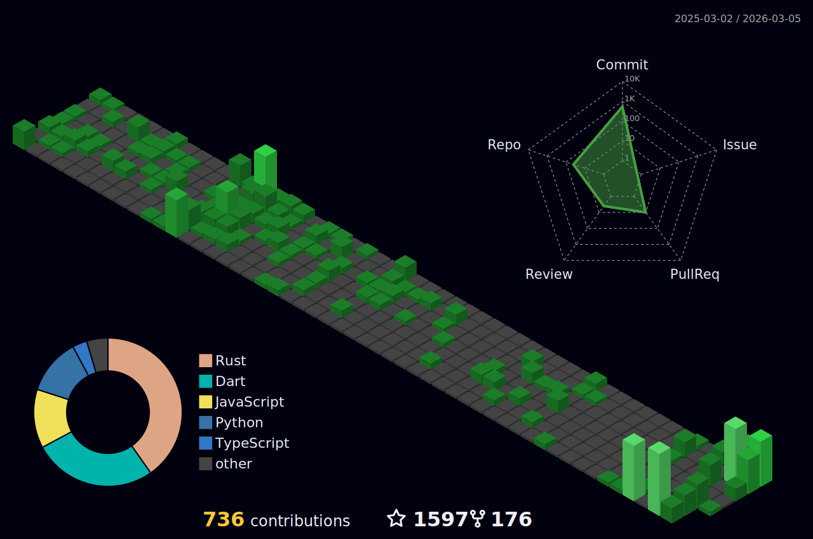

# Lakshman Turlapati

### Hi there, I'm Lakshman!

I'm an AI developer driven to build scalable, user-centric applications that bridge the gap between technology and human needs. My journey began in full-stack development at **Church & Dwight** (2022-2024) and took a sharp turn into AI after a transformative experience at TAMUHack. Now, my passion is creating intelligent, multi-agentic systems and developer tools that are both powerful and intuitive.

-  I'm currently building **open-source AI tools** -- building what matters!
-  My project, **Review-Gate**, hit **1,528+ GitHub stars** and 167 forks!
-  I'm **2x AWS Certified** and an **AWS Cloud Captain**, one of ~100 selected globally each year.
-  I'm pursuing my **MS in IT & Management** at **UT Dallas** ('26), where I'm also a **Dean's Impact Scholar** with a 3.9 GPA.
-  Let's connect and build tech that matters!

 

## Featured Projects

 

## My Tech Stack

**AI & Machine Learning**
 

 

**Cloud & DevOps**
 

 

**Full-Stack Development**
 

 

## Trophies

 

## GitHub Stats

  
  
   
  
   
  
   
  
  
    
  

 

## Activity Insights

  

 

## Contribution Graph

<picture>
  <source media="(prefers-color-scheme: dark)" srcset="https://raw.githubusercontent.com/LakshmanTurlapati/LakshmanTurlapati/output/github-snake-dark.svg" />
  <source media="(prefers-color-scheme: light)" srcset="https://raw.githubusercontent.com/LakshmanTurlapati/LakshmanTurlapati/output/github-snake.svg" />
  
</picture>

 

 

  From full-stack to AI -- challenging the status quo, one line of code at a time.
   
  

